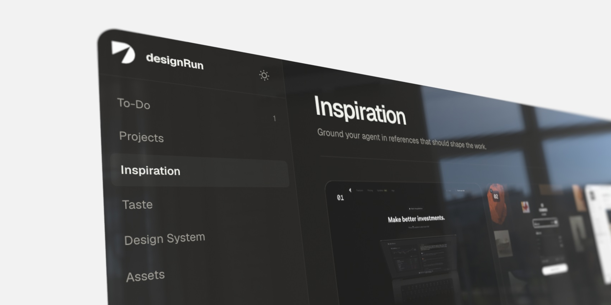

<p align="center">
  
</p>

<p align="center"><strong>A local agent workspace for product design.</strong></p>

<p align="center">
  <a href="https://github.com/mtthw-blfrmn/designRun/actions/workflows/ci.yml"></a>
  <a href="./LICENSE"></a>
  
</p>

designRun is a code-native design operating system that lives inside the same project your agent can read and change. It gives designers and coding agents one version-controlled source for taste, inspiration, product context, design standards, reusable workflows, decisions, and proven patterns.

Download it, open the folder in Codex, Claude Code, Cursor, or another repository-aware agent harness, and ask for the design outcome directly. There is no separate designRun service and no formal “run” object to manage. designRun is the workspace.

Codex in the ChatGPT desktop app is recommended because it combines local project access with a shared browser for inspecting local product UIs. Codex CLI and the Codex IDE extension still load the repository instructions and skills, but they do not include that built-in browser. Other harnesses remain supported through the same plain files and adapters.

## What you get

- A local control center for To‑Do, Projects, Inspiration, Taste, Design System, Assets, Tools, Skills, and source documents.
- Editable Markdown as the durable source of truth, with conflict-aware local write-back.
- Project scaffolds for briefs, evidence, decisions, prototypes, deliverables, and implementation boundaries.
- A fully fictional worked project with a stateful flow and engineering-ready sample PRD.
- Fourteen provenance-checked product-reference analyses with inspectable media, canonical owner links, and explicit reuse boundaries.
- Agent instructions and reusable skills for decisions, research, requirements, flows, critique, design-to-code work, component polish, reference capture, and pattern promotion.
- A shared design layer that can improve from patterns proven in real product work.
- Harness adapters for Codex, Claude Code, Cursor, GitHub Copilot, and other instruction-aware tools.

Everything stays on your machine unless you explicitly publish or connect it.

> **Project status:** designRun is pre-1.0 and ready for local use. Source formats may evolve while the public workflow is tested; material changes will be documented in [CHANGELOG.md](./CHANGELOG.md).

## Get designRun

Choose the path that matches how you want to work:

- **Use this template** — click GitHub’s **Use this template** button to create your own repository with clean ownership.
- **Download** — choose **Code → Download ZIP**, extract it, and open the extracted root folder in your agent harness. Git history is optional.
- **Clone** — run:

```bash
git clone https://github.com/mtthw-blfrmn/designRun.git
cd designRun
```

Open the repository root—not only `app/`—in Codex, Claude Code, Cursor, or another repository-aware agent.

## Start with one prompt

Open the repository root in your agent harness and say:

```text
I am designing a product called [name]. [Describe it in your own words.] Set up the project, shape the brief from what I know, and help me decide what to design first.
```

The agent creates the project when needed and works from the repository guidance. Read [Start here](./START-HERE.md) for more examples.

No installation is required for the file-backed agent workspace. Node.js is needed only for the optional control center, scaffolding commands, and validation.

## Open the control center

Requirements: Node.js 22.13 or newer.

```bash
npm ci
npm run dev
```

Open `http://127.0.0.1:4100`. The browser is optional, but it is not decorative: it is the local control surface for the same sources the agent uses. Agent edits appear automatically while the app is running.

## Commands

```bash
npm run dev                         # Build the index and start the control center
npm run new:project -- "My Product" # Create a clean project workspace
npm run new:deliverable -- my-product "Onboarding prototype"
npm run new:reference -- "Reference" "https://source.example" "Source owner"
npm run validate                    # Validate sources, skills, and project structure
npm test                            # Test discovery, parsing, and safety invariants
npm run check                       # Validate, test, lint, and build
```

## Workspace map

```text
designRun/
├── AGENTS.md              Agent constitution and routing
├── START-HERE.md           Human first-use path and prompt examples
├── taste/                 Durable design judgment
├── inspiration/           References and extracted principles
├── knowledge/             Operating model and shared to-dos
├── resources/             System rules, tools, and asset libraries
├── projects/              Product-specific context and artifacts
├── patterns/              Reviewed cross-project patterns
├── .agents/skills/        Reusable agent workflows
├── templates/             Clean project scaffolds
├── scripts/               Local discovery and validation
└── app/                   Source-backed local control center
```

The included Relay project and its two To‑Dos are synthetic teaching material. See [Worked sample](./docs/sample-project.md) to trace or remove them. Real reference media recovered from the original local workspace is retained as source-attributed editorial evidence; [reference provenance](./resources/reference-provenance.md) explains the public-release gate.

Before making a fork or template public, run `npm run release:check`. It performs the full quality gate and refuses release while private or unresolved-rights example media remains tracked.

## Harness support

| Harness | Repository instructions | Repository skills | Local UI inspection |
| --- | --- | --- | --- |
| Codex desktop | Yes | Yes | Built-in browser recommended |
| Codex CLI / IDE | Yes | Yes | Use available browser or test tooling |
| Claude Code | `CLAUDE.md` adapter | Skills remain readable | Depends on local setup |
| Cursor | `.cursor/rules/` adapter | Skills remain readable | Depends on local setup |
| GitHub Copilot | `.github/copilot-instructions.md` | Skills remain readable | Depends on local setup |
| Other repository-aware agents | Start at `AGENTS.md` | Skills are plain Markdown | Depends on the harness |

Native skill discovery differs by harness, but the operating model and sources remain portable files.

## How it improves

Projects inherit shared taste and system rules without copying them. Work happens in the owning project or codebase. When a component, interaction, or decision proves reusable, the `pattern-promotion` workflow strips out project-specific assumptions and promotes the durable lesson back into the shared system. That is how the baseline rises without one person policing every screen at the end.

Read [Getting started](./docs/getting-started.md), [Worked sample](./docs/sample-project.md), [Architecture](./docs/architecture.md), [Workflows](./docs/workflows.md), and the candid [Product readiness review](./docs/product-readiness.md) for the operating model and its deliberate boundaries.

## Contributing and support

- Read [CONTRIBUTING.md](./CONTRIBUTING.md) before proposing a change.
- Use [GitHub Issues](https://github.com/mtthw-blfrmn/designRun/issues) for reproducible defects and scoped proposals.
- Use [GitHub Discussions](https://github.com/mtthw-blfrmn/designRun/discussions) for questions and workflow ideas.
- Report vulnerabilities privately as described in [SECURITY.md](./SECURITY.md).
- Read [SUPPORT.md](./SUPPORT.md) for the information that makes a report actionable.

## Privacy

Do not commit secrets, customer data, private transcripts, or licensed assets you cannot redistribute. Local creation never grants an agent permission to publish, deploy, upload, or message external systems.

designRun is licensed under the [MIT License](./LICENSE).
