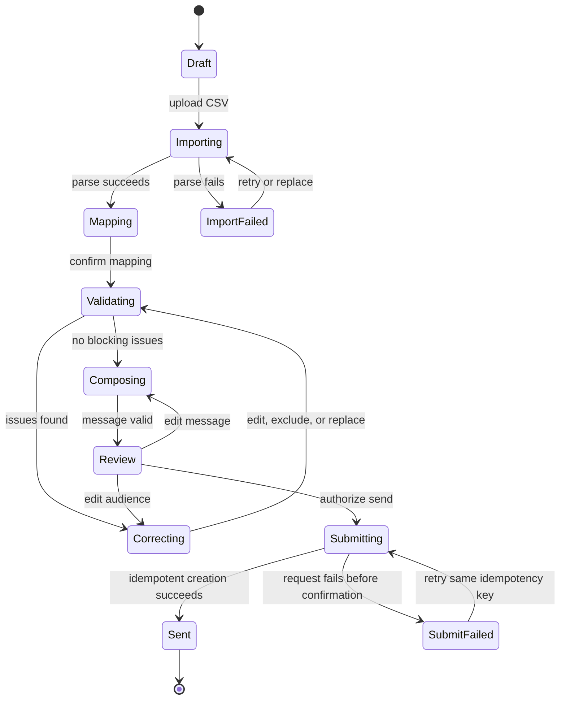

# Relay outreach workspace flow

> Fictional worked example. No production behavior is implied.

## Contract

- **Actor:** coordinator with `campaign:create` permission
- **Entry:** organization exists and at least one approved sender is available
- **Goal:** create exactly one simulated send run from a reviewed audience and message
- **Primary object:** campaign draft
- **Irreversible boundary:** send-run submission

## State transition model

## Transition table

| ID | From | Trigger | Guard | System effect | User feedback | Recovery |
| --- | --- | --- | --- | --- | --- | --- |
| T-01 | Draft | Select CSV | File is readable and within policy | Create import attempt and stream parse | File identity, progress, cancel | Cancel returns to Draft |
| T-02 | Importing | Parse complete | At least one row and header | Persist column sample, not send audience | Mapping form with detected suggestions | Replace file |
| T-03 | Mapping | Confirm mapping | Required destination fields mapped once | Run normalization and validation | Determinate progress when measurable | Return to mapping with values preserved |
| T-04 | Validating | Results complete | Blocking issues exist | Persist issue set and audience counts | Move to Correcting; focus summary | Fix, exclude, remap, or replace |
| T-05 | Correcting | Apply resolution | Resolution is permitted for issue type | Recompute affected rows and counts | Updated counts announced politely | Undo last local correction |
| T-06 | Composing | Continue | Message is non-empty and within channel limits | Save message revision and preview checksum | Review surface | Return to composer |
| T-07 | Review | Submit | No blocking issues; snapshot unchanged | Create send run using idempotency key | Pending state; controls disabled | Retry safely or return if precondition fails |
| T-08 | Submitting | Provider accepted | Matching request and snapshot IDs | Freeze recipient records and append events | Confirmation with run ID and counts | Create new draft for changes |

## Dependency invalidation

| Change | Preserve | Recompute or clear | Confirmation required |
| --- | --- | --- | --- |
| Replace source file | Campaign identity, sender, message | Mapping, corrections, audience, review snapshot | Yes, when corrections exist |
| Change mapped email field | Message, sender | Normalized values, issues, audience, review snapshot | Yes |
| Exclude a row | Mapping and other corrections | Counts and review snapshot | No; reversible before submission |
| Change sender | Audience and message | Preview and review snapshot | No |
| Edit message after review | Audience | Message checksum and review snapshot | No |
| Retry failed submission | Entire frozen snapshot | Nothing | No; reuse original idempotency key |

## Failure and resume rules

- A refresh resumes the latest saved draft revision and labels unsaved local input separately.
- A parse or validation failure never deletes the uploaded source reference until the user replaces or removes it.
- If submission status is unknown, the client queries by idempotency key before offering another send action.
- Permission loss moves the draft to read-only; it does not discard work.
- A submitted run is immutable. Correction always branches to a new draft.
