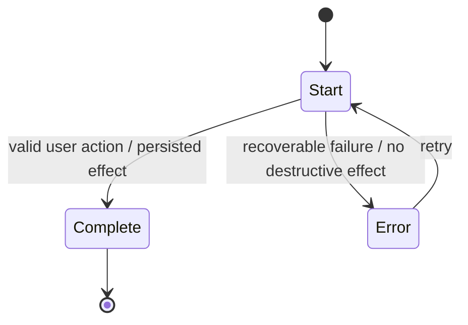

# User flow — Replace with task

## Contract

- Actor:
- Entry condition:
- Trigger:
- Intended outcome:
- Product object:
- Critical transition:

## State model

## Transition table

| From | Event | Guard | System effect | Feedback | To | Recovery |
|---|---|---|---|---|---|---|
| | | | | | | |

## State requirements

Cover empty, loading, partial, invalid, permission-denied, error, retry, cancellation, back navigation, resume, concurrent update, and terminal states when relevant.

## Assumptions and open decisions

## Riskiest transition and validation

